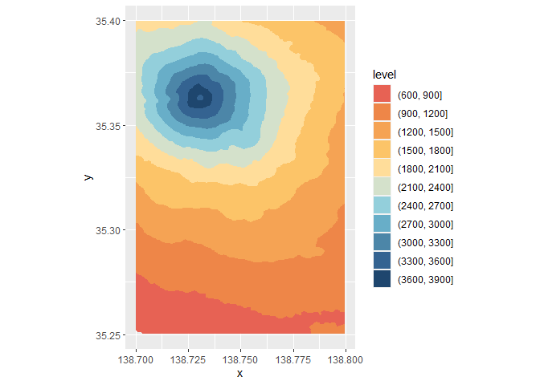
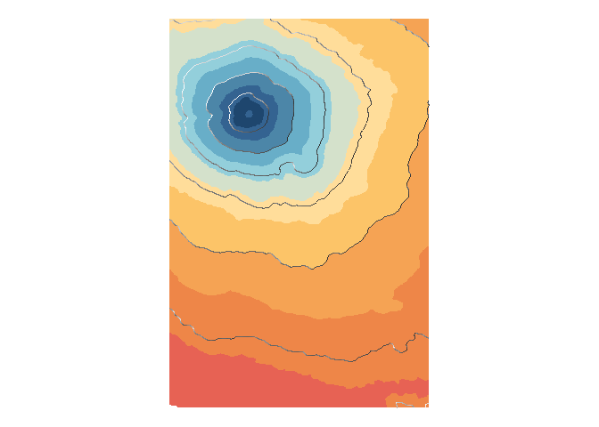

This is an example of how to update the cover art of GA using generative
art. This is a cover from 1970: 

An update would be colorful, but still make references to geographically
relevant stuff! [Tanaka
contours](http://wiki.gis.com/wiki/index.php/Tanaka_contours) sounds
like a lovely idea.

I will use the following packages:

``` r
library(elevatr) # To get elevation data
library(MetBrewer) # Color palettes
library(metR) # For contouring 
library(terra) # To work with rasters
library(tidyverse) # Data carpentry and ggplot2
```

Use {elevatr} to get elevation data:

``` r
fuji <- get_elev_raster(locations = data.frame(x = c(138.7, 138.8), 
                                               y = c(35.25, 35.4)),
                        z = 10, 
                        prj = "EPSG:4326",
                        clip = "locations")
```

    ## Mosaicing & Projecting

    ## Warning: multiple methods tables found for 'direction'

    ## Warning: multiple methods tables found for 'gridDistance'

    ## Clipping DEM to locations

    ## Note: Elevation units are in meters.

Convert to {terra} `SpatRaster` object and thereof to data frame:

``` r
fuji <- rast(fuji)

fuji <- as.data.frame(fuji, 
                      xy = TRUE) %>%
  rename(elev = 3)
```

Plot contours; use `Hiroshige` palette from
[{MetBrewer}](https://github.com/BlakeRMills/MetBrewer):

``` r
cols <- met.brewer("Hiroshige", n = 11)

ggplot(data = fuji,
       aes(x, y, z = elev)) +
  geom_contour_filled(breaks = seq(600, 3900, 300)) +
  #geom_contour_tanaka() + 
  scale_fill_manual(values = cols) +
  coord_equal()
```

<!-- -->

Repeat plot but now with Tanaka countours:

``` r
ggplot(data = fuji,
       aes(x, y, z = elev)) +
  geom_contour_filled(breaks = seq(600, 
                                   3900, 
                                   300)) +
  geom_contour_tanaka(sun.angle = 260, 
                      smooth = 10) + 
  scale_fill_manual(values = cols) +
  coord_equal() + 
  theme_void() + 
  theme(legend.position = "none")
```

<!-- -->

``` r
ggsave("fuji-tanaka-contours.png",
       width = 4,
       height = 7,
       units = "in")
```
